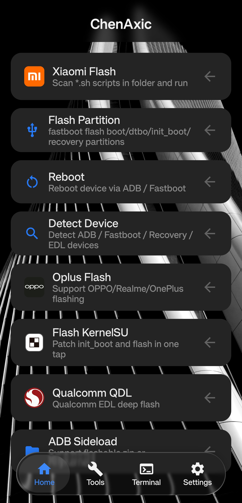
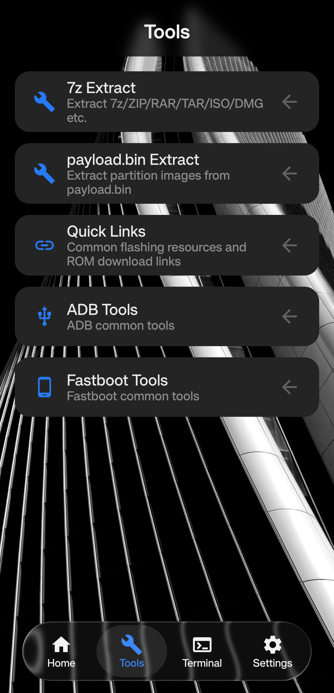
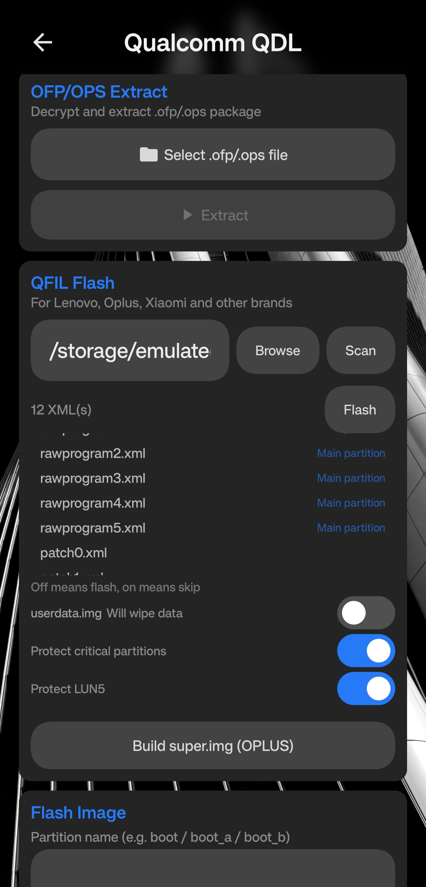
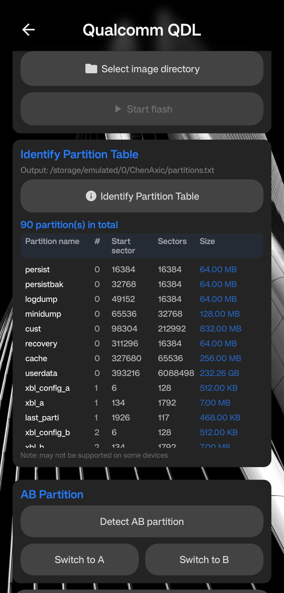
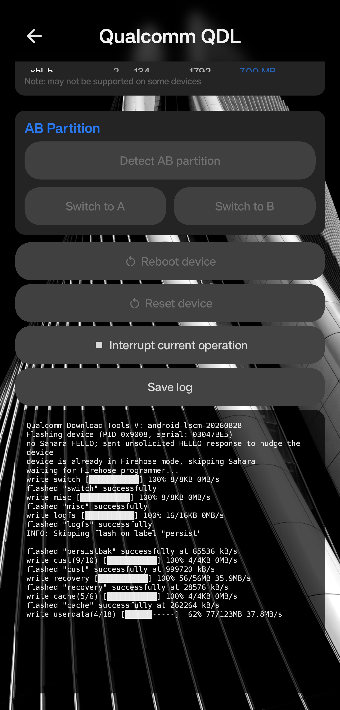
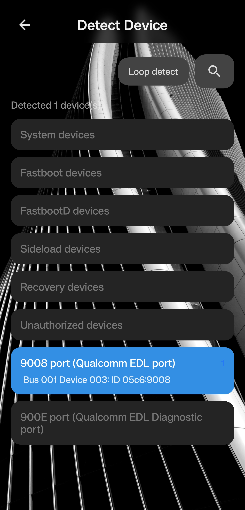
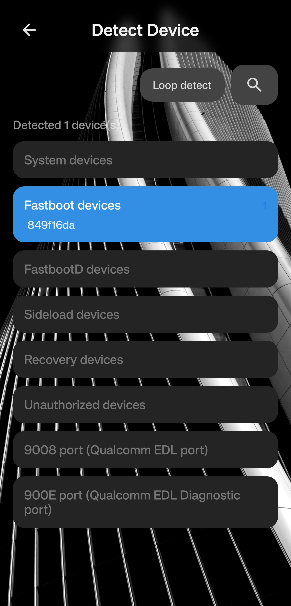

#  ChenAxic — Android Flashing Tool

 

An Android flashing tool built on **Jetpack Compose + MIUIX (HyperOS style)**, supporting **Fastboot / ADB / 9008 (EDL)** modes.

## ⚠️ Closed-Source Notice

> This project is **closed-source**. Decompilation, derivative works, and commercial use are strictly prohibited.

---

## 📋 Project Info

| Item | Value |
|---|---|
| Package | `com.ChenXluk.org` |
| UI | Jetpack Compose + **MIUIX** (HyperOS component library) |
| Requirements | Android 11+ (minSdk 30), **root / su** required |

---

## 📸 Screenshots

  
  
  

  
  
  

  

---

## 🛠️ Main Features

### Flashing
- **Mi Flash-style flashing** (Xiaomi)
- **Fastboot / FastbootD flashing**
- **ADB Sideload**
- **Oplus Flash** — normal flashing / pure FastbootD flashing (OPPO / Realme / OnePlus, via fastboot)
- **KernelSU flashing**
- **Qualcomm QDL (9008 EDL)** — see below

### Qualcomm QDL Panel (9008 EDL)
- **OnePlus VIP authorization** — melf + Digest.elf + Sign.bin three-file authorization
- **OFP/OPS unpacking** — unpack OPPO / OnePlus / Realme packages
- **QFIL flashing** — flash according to rawprogram / patch XML
- **Partition read/write** — flash / extract / erase partitions
- **Dry-run simulation** — simulated flashing, no device connection, nothing written
- **A/B slots** — GPT active-slot detection and slot switching
- **Protections** — skip `persist / ocdt / secdata` and LUN5, skip userdata
- **Model / SoC quick selection** — auto-detect authorization type and fill in programmer files

### Device Tools
- **ADB / Fastboot command panel** (with common shortcuts)
- **Device detection / info** (brand, model, SoC, etc.)
- **Reboot to multiple modes**
- **Install APK**
- **7z / payload.bin extraction**
- **Built-in terminal**
- **Quick links** (ROM / Recovery / Root tool collection)

### Personalization
- Languages (Simplified Chinese / Traditional Chinese / English)
- Custom theme colors, wallpaper background, liquid glass / frosted glass effects

---

## 💡 Notes
- Flashing is risky — verify device model and file match before operating. **Any damage caused by using this tool is the user's own responsibility**
- This tool is for personal device maintenance and learning only, and **must not be used for any illegal purpose**

---

## 🌐 Related
- [Jetpack Compose official docs](https://developer.android.com/jetpack/compose)
